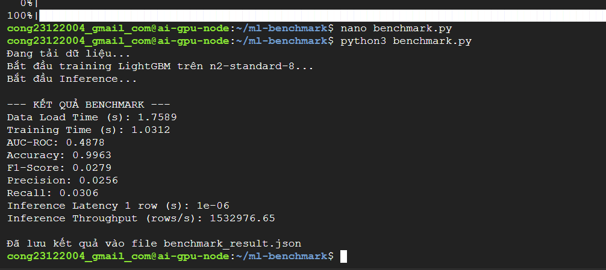
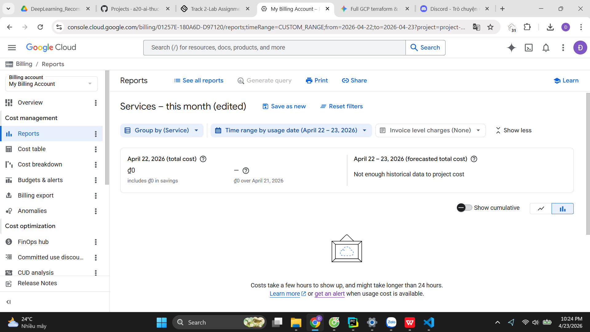
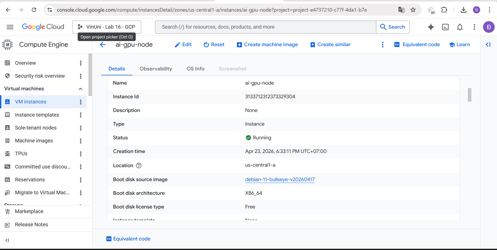

# Báo cáo Thực hành Lab 16 - Triển khai Hạ tầng AI trên Google Cloud (GCP)

## 1. Thông tin chung
- **Sinh viên:** Đào Văn Công
- **Mã sinh viên:** 2A202600031
- **Dự án:** Triển khai Machine Learning Infrastructure với Terraform
- **Cấu hình máy chủ:** `n2-standard-8` (8 vCPU, 32GB RAM)
- **Phương án thực hiện:** CPU Fallback (LightGBM) 

# 2. Kết quả Benchmark mô hình
Kết quả thu được sau khi chạy script `benchmark.py` trên môi trường GCP:

| Tham số đo lường | Giá trị kết quả |
| :--- | :--- |
| **Thời gian huấn luyện (Training Time)** | **1.0312 giây** |
| **Độ chính xác (Accuracy)** | 99.63% |
| **Chỉ số AUC-ROC** | 0.4878 |
| **F1-Score** | 0.0279 |
| **Tốc độ suy luận (Throughput)** | ~1,532,976 dòng/giây |

### Ảnh chụp màn hình kết quả Terminal:


## 3. Phân tích kĩ thuật
- **Về hạ tầng:** Terraform giúp tự động hóa luồng thiết lập từ VPC Network, Firewall, khởi tạo Instance. 
- **Về mô hình:** Sử dụng LightGBM trên CPU `n2-standard-8`.
- **Về dữ liệu:** Chỉ số Accuracy cao nhưng F1-Score thấp đúng với đặc điểm của dataset Credit Card Fraud (là dữ liệu mất cân bằng).

## 4. Minh chứng chi phí và Dọn dẹp
- **Báo cáo Billing:** Hệ thống GCP Billing có độ trễ cập nhật (như thông báo của Google). Em đã kiểm tra và chụp lại dashboard tại thời điểm hoàn thành. Ngoài ra có thêm ảnh minh chứng VM Instance vẫn chạy.



- **Xác nhận hủy tài nguyên:** Đã thực hiện lệnh `terraform destroy` thành công để giải phóng 16 tài nguyên.

## 5. Tài liệu đính kèm
- **Dữ liệu máy học:** [benchmark_result.json](evidence/benchmark_result.json)
- **Mã nguồn triển khai:** [Thư mục Terraform-GCP](./terraform-gcp/)

- kết quả `benchmark_result.json`
```json
{
    "Data Load Time (s)": 1.7589,
    "Training Time (s)": 1.0312,
    "AUC-ROC": 0.4878,
    "Accuracy": 0.9963,
    "F1-Score": 0.0279,
    "Precision": 0.0256,
    "Recall": 0.0306,
    "Inference Latency 1 row (s)": 1e-06,
    "Inference Throughput (rows/s)": 1532976.65
}
```

- file `terraform-gcp.zip`: [terraform-gcp.zip](./terraform-gcp.zip)
